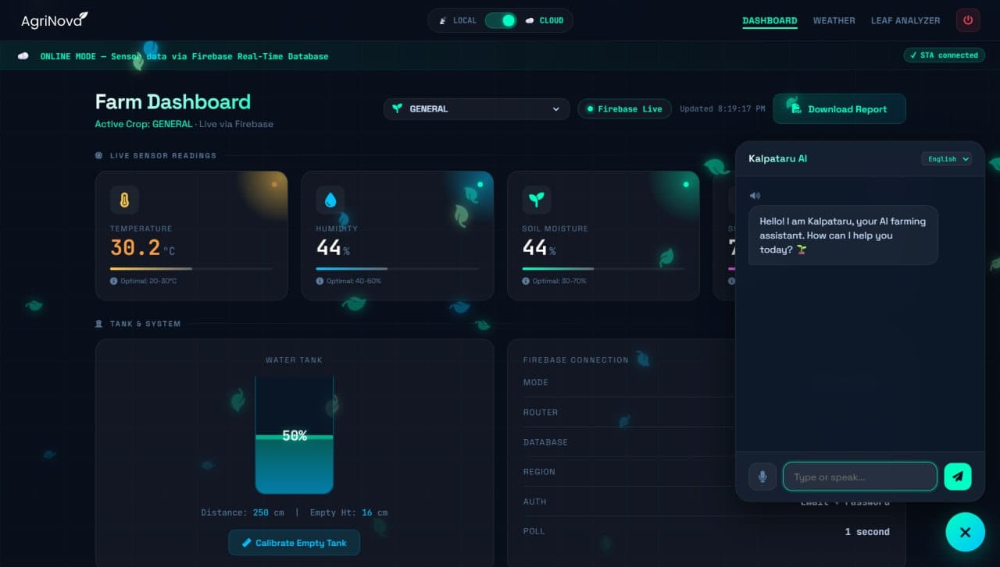
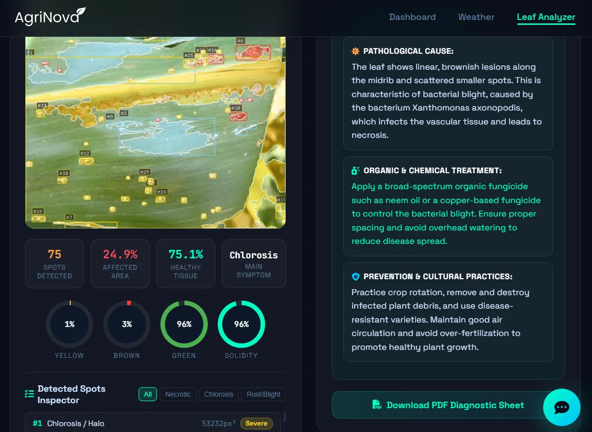
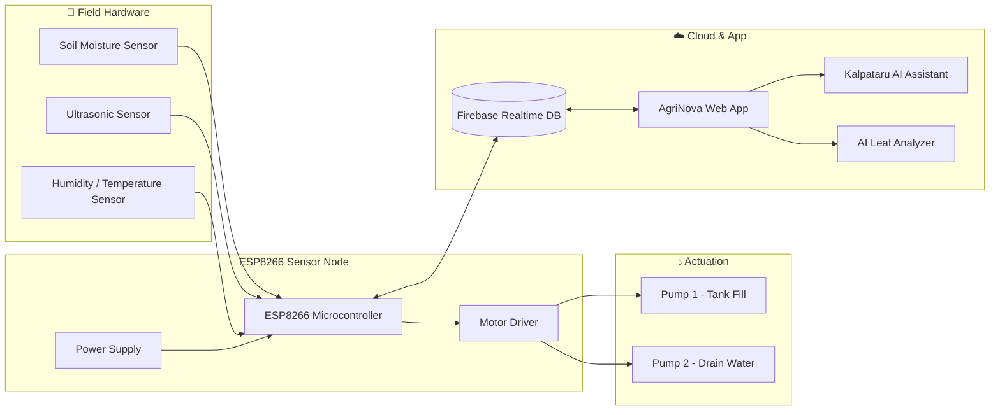

<div align="center">


<!-- animated title -->
<a href="https://github.com/IamSristi/AgriNova">
  
</a>

<p>

**IoT • AI • Cloud — a complete precision-farming platform**
built by Team Innovengers for our B.Tech Final Year Project

</p>


<br/>


<br/>


</div>

<br/>


## 🌾 About the Project

**AgroSmart (a.k.a. AgriNova)** is an end-to-end IoT-based smart agriculture system that fuses **embedded sensing**, **cloud connectivity**, and **artificial intelligence** into one integrated platform. Instead of forcing farmers to juggle separate tools for irrigation timers, soil sensors, and disease guides, AgriNova brings **live sensor monitoring, automated irrigation, AI-powered plant-disease diagnosis, and a conversational farming assistant** together in a single dashboard.

> 💡 Most existing smart-farming tools solve *one* problem — a moisture sensor here, a timer there. AgriNova was designed to close that gap with a single, affordable, farmer-friendly system that also works when the internet doesn't.

<br/>

## ✨ Key Features

<table>
<tr>
<td width="50%" valign="top">

### 📡 Real-Time Sensing
- Live soil moisture, temperature, humidity & water-level readings
- ESP8266-based sensor nodes streaming to Firebase Realtime Database
- Local + Cloud hybrid mode toggle for low-connectivity areas

### 💧 Smart Irrigation
- Automated dual-pump system (tank fill + drain)
- Ultrasonic tank-level sensing with calibratable empty height
- Environment-aware control to cut water wastage

</td>
<td width="50%" valign="top">

### 🧠 AI Leaf Analyzer
- Upload/scan a leaf image for instant disease detection
- Pathological cause breakdown + organic/chemical treatment plan
- Prevention & cultural-practice recommendations
- Exportable PDF diagnostic sheet

### 💬 Kalpataru — the AI Farming Assistant
- Chat-based crop guidance in natural language
- Voice input support
- Multi-language ready

</td>
</tr>
</table>

### 🌞 Sustainability Built-In
- Solar-powered hardware to cut electricity dependency
- Rainwater harvesting integration
- Designed for small & marginal farmers, not just large agribusiness

<br/>


## 📸 App Preview

<div align="center">

**Farm Dashboard — live sensor telemetry, tank status & Kalpataru AI assistant**



<br/><br/>

**Leaf Analyzer — AI-driven disease detection with treatment guidance**



</div>

<br/>


## 🏗️ System Architecture



<br/>

## 🧰 Tech Stack

<div align="center">

| Layer | Technologies |
|---|---|
| **Hardware / Firmware** | ESP8266, Soil Moisture / Ultrasonic / DHT Sensors, Motor Driver, Solar Power Module |
| **Connectivity** | Wi-Fi (STA/Local mode), Firebase Realtime Database, hybrid Wi-Fi + LoRa (planned) |
| **Backend** | Python, Flask (`app.py`), `leaf_detector.py` for AI inference |
| **AI / ML** | Leaf disease classification model, chatbot-driven crop guidance (Kalpataru) |
| **Frontend** | Web dashboard (Local/Cloud toggle, live charts, chat widget) |
| **Data / Config** | `crops_requirements.json`, `thresholds.json`, Firebase Realtime DB |

</div>

<br/>


## 🚀 Getting Started

### Prerequisites
- Python 
- A Firebase project (Realtime Database enabled)
- ESP8266 board + supported sensors (for the hardware side)

### Installation

```bash
# 1. Clone the repository
# 2. Install dependencies
# 3. Note: Ollama model files not shared in this repo yet
# 4. Configure environment variables
# 5. Run the app
```

<br/>

## 📂 Project Structure

```
AgriNova/
├── app.py                     # Flask application entry point
├── leaf_detector.py           # AI leaf disease detection logic
├── crops_requirements.json    # Crop-specific requirement data
├── thresholds.json            # Sensor threshold configuration
├── example.json                # Sample data
├── chat-widget-check.js       # Kalpataru chat widget helper
├── requirements.txt           # Python dependencies
├── run_app.bat                # Windows launch script
├── QUICKSTART.md
├── BUGFIX_README.md
└── png files                # App screenshots (dashboard, leaf analyzer)
```

<br/>


## 🔬 Research Foundation

This project builds on a literature review of recent work in IoT-driven precision agriculture, edge-computing for low-latency sensing, and AI/ML-based real-time farm monitoring — and targets the gaps that recur across that body of work:

- ❌ Fragmented single-purpose tools → ✅ one integrated platform
- ❌ Timer-based irrigation → ✅ environment-aware, sensor-driven control
- ❌ Fully internet-dependent systems → ✅ Local/Cloud hybrid mode
- ❌ Expensive precision-ag hardware → ✅ low-cost, open-source stack
- ❌ Lab-only AI models → ✅ a field-usable Leaf Analyzer with real recommendations

<br/>

## 🗺️ Roadmap

- [ ] LoRa-based hybrid communication for zero-connectivity zones
- [ ] Replace ESP8266 with ESP32 to implement ph sensor. (ESP8266 has only one analog pin)
- [ ] Mobile app companion
- [ ] Expanded multi-language support for Kalpataru

<br/>

## 👥 Team
<div align="center">
   Srinjoy Tambuli 
  💠 Sristi Paul
  💠 Shreyasee Biswas  
  💠 Sourik Banerjee  
  💠 Soham Das 
  💠 Suchana Das  

</div>

<div align="center">

### 🌱 Built with care for farmers, by Team Innovengers


**⭐ Star this repo if you find it useful!**

</div>
